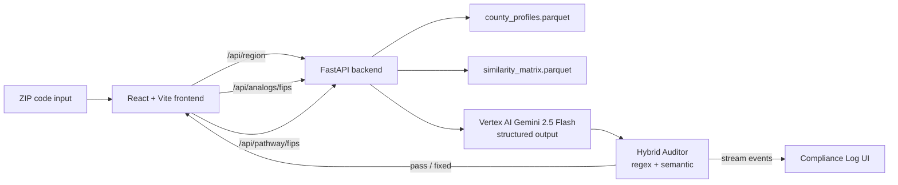

# Hometown Pathway Atlas

> **Per-capita parity. County granularity. Audit-grade.**
> A single per-county lens for Olympic and Paralympic representation
> that nobody else has.

[](LICENSE)
[](https://cloud.google.com/run)
[](https://cloud.google.com/vertex-ai)

Built for the **Team USA × Google Cloud Hackathon Challenge 2** (Hometown
Success Engine). Submission deadline May 11, 2026.

---

## The opening stat

**63 percent** of 2024 U.S. Paralympic athletes came through one
national network of community-based adaptive sports chapters. That
network reaches only a fraction of U.S. counties. A kid in Cobb
County wanting to know if anyone from a place like hers ever made
Team USA — has no way to find out.

*Source: Move United 2024 Impact Report (141 of 225 ≈ 63%).*

Hometown Pathway Atlas changes that.

---

## Live demo

- **App:** `https://atlas-frontend-xxxxxx-uc.a.run.app/` *(updated Day 8 post-deploy)*
- **Video:** `https://youtu.be/<video-id>` *(updated Day 9 post-record)*
- **Try ZIP:** `30060` (Cobb County, GA — anchor region for the demo flow)

---

## What makes it different

### 1. Per-capita parity discipline

Olympic and Paralympic representation are shown side-by-side, never
merged into a single number. Every metric carries an evidence-strength
label. Per-capita normalization with empirical Bayes shrinkage so a
single small county doesn't blow up the signal — or get drowned by
megacounties.

### 2. County FIPS granularity

The analytical unit is the county FIPS code, not state. Existing
public maps stop at state level. At county level: silence. Atlas
fills that gap with consistent methodology across all 3,000+ U.S.
counties.

### 3. Three-dimension peer similarity

Each county gets matched to 3 peer counties our similarity model
could be associated with — not by population, but by athlete profile
(40%), sport mix (35%), and climate (25%). Weighted, MSA-diversified,
explained per dimension in the UI.

### 4. Compliance Log ★ — judge-visible AI safety

Every Gemini-generated narrative passes through a hybrid auditor
before it reaches the user. Layer one is deterministic regex catching
banned causal phrases. Layer two is Gemini itself evaluating semantic
causal tone. The audit log streams live in the UI — judges can watch
the auditor catch a draft like *"Cobb County PRODUCES Olympic athletes"*
and rewrite it conditionally to *"could be associated with Olympic
representation patterns."* Live. Visible. Auditable. **This is the
Pillar 4 demo moment.**

---

## Architecture



*Full architecture spec: `docs/01_architecture_spec.docx`. SVG diagram
ships with task 5.8 — replaces this Mermaid placeholder.*

---

## Tech stack

**Frontend**
- React 19 + Vite 8 + TypeScript strict
- Tailwind v3 with custom Atlas Editorial palette
- Framer Motion 12 (motion choreography)
- react-simple-maps 3 (US choropleth via us-atlas TopoJSON)
- @tanstack/react-query 5 (data fetching + cache)
- Sonner 2 (toast)

**Backend**
- FastAPI + Python 3.12
- Pydantic v2 (strict typed I/O)
- pandas + pyarrow (precomputed Parquet at startup)

**AI**
- Vertex AI Gemini 2.5 Flash with structured output JSON schemas
- Hybrid auditor: deterministic regex + semantic Gemini self-review

**Hosting**
- Google Cloud Run (us-central1)
- Artifact Registry + Cloud Build CI
- Frontend nginx:alpine image, backend python:3.12-slim image

**Data**
- 2016–2024 Team USA roster (Olympic + Paralympic combined)
- US Census ACS 5-year population (county denominator)
- NFHS Athletics Participation Survey (high school context)
- HUD ZIP–County crosswalk
- nClimGrid 5km gridded climate
- Move United chapter directory (display-only, never load-bearing)

---

## Run locally

### Prerequisites

- Node 22 + npm 10
- Python 3.12 + uv or pip
- macOS / Linux (Windows untested)

### Frontend

```bash
cd frontend
npm install --legacy-peer-deps
npm run dev
# → http://localhost:5173
```

The frontend ships with mock data baked in. The full Pillar 4 demo
sequence (ComplianceLog ★ catching + rewriting a banned phrase) plays
automatically on the results view via `demoMode={true}`.

**Sentinel ZIP:** type `00000` to trigger the error path (returns a
synthetic 404 + Sonner toast — exercises the `try/catch` arm before
real backend integration).

### Backend

See `backend/README.md` (Vinh's section).

```bash
cd backend
uv sync                # or: pip install -r requirements.txt
uvicorn main:app --reload --port 8000
# → http://localhost:8000
```

Frontend env var: set `VITE_API_BASE_URL=http://localhost:8000` in
`frontend/.env.local` if your backend runs on a different host/port.

### Cloud Run deploy

See `docs/cloud_run_deploy.md` for the Day 8 deploy runbook.

---

## Hackathon context

Built in 10 days (May 1–11, 2026) by a team of two. Strategy is
**Maximum Scope with Cuttable Layers**: a conservative version ships
end-to-end first (Days 1–6), then ambitious layers stack on top
(Days 7–9) — each independently cuttable if it threatens the deadline.
Conservative ships first, always.

Locked architectural decisions, build order, and cut triggers live in
[`CLAUDE.md`](CLAUDE.md). Daily status + task ownership lives in
[`PLAN.md`](PLAN.md).

The Pillar 5 business numbers (TAM, cost framing, revenue model) are
locked + sourced in [`docs/pitch_pillar5.md`](docs/pitch_pillar5.md).

---

## Team

- **Stephen Sookra** — frontend, pitch, project architecture
- **Vinh Le** — backend, data pipeline, AI

---

## License

Apache License 2.0 — see [LICENSE](LICENSE).

The Atlas Editorial design system, Compliance Log auditor pattern, and
Pillar 5 business framing are all open for reuse. Built in 10 days by
two people during the Team USA × Google Cloud Hackathon.
